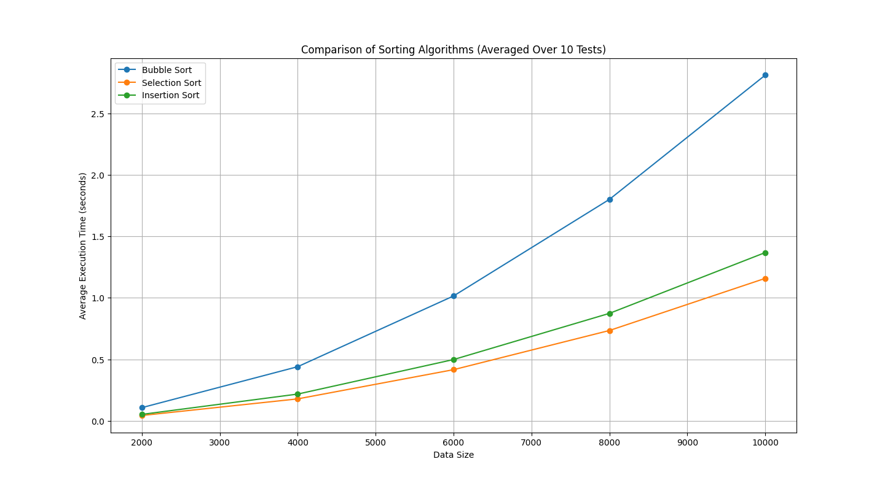

# *Basic Sorting Algorithms*

In this article, I will present 3 algorithms: Bubble Sort, Selection Sort, Insertion Sort, which one works and how. And why are the operating speeds not the same? This article will explain it for you to understand.

### *First (What Bubble Sort, Selection Sort, Insertion Sort is?)*

#### Bubble Sort

Work by comparing and swapping items in a list to sort them in ascending or descending order. This algorithm works by traversing a data list multiple times, comparing and shuffling data that is out of order to the most correct position each cycle until the data list is completely sorted. Therefore, the operation of Bubble Sort can be described as follows:

1. Start at the first position of the data list (index 0).

2. Compare the value at the current location with the value at the next location (index +1) in the data list.

3. If the value at the current location is greater than the value at the next location Toggle the data values in these two positions.

4. Move to the next position in the data list.

5. Repeat steps 2-4, continuously comparing and alternating data, until you reach the final position in the data list in the first round.

6. Now the largest value will be at the end of the data list. (last position)

7. Repeat steps 1-6, reducing the order of the positions to be compared and swapped down by one position in the data list. until there are no more value changes.

8. When there is no value switching at all in any round. Indicates that the data list has finished sorting and the algorithm will stop.

When we compare it to Big O Notation, Bubble Sort is O(n^2), meaning the algorithm performs poorly as the data size increases.

#### Selection Sort

It works by finding the smallest value. (or the largest value, depending on your desired sorting) in the list of data and swap this value with the value at the first position of the list. Then move the position with the sorted value to the front. Repeat this process until the data list is sorted.

Here's how Selection Sort works:

1. Find the smallest value in a list starting from the first position of the list (index 0), compare this value with the values in the following positions (index 1), and find the smallest value in the remaining list.

2.When the smallest value is found Swap this value with the value in the first position of the list (index 0).

3. Move to the next position in the list (index 1) and make the rest of the list sort by the smallest value in the rest of the list.

4. Repeat steps 1-3 until all data items are sorted.

The function of Selection Sort is to find the smallest value in a list of data and toggle that value to the correct position. As a result, the smallest value ever is sorted to the front of the list every time it is run. By changing the value every time This algorithm keeps the smallest value based on the correct front of the list. and results in a list of data arranged in the order you want.

When we compare with Big O Notation, Selection Sort is O(n^2), which means that the algorithm doesn't perform well as the data size increases. It's like Bubble Sort, but Selection Sort tends to run faster than Bubble Sort in the case. With more data, that's because Selection Sort has less switching when encountering the smallest value. And so it keeps working on the search process, while Bubble Sort has to wait until the end of all comparisons and swaps.

#### Insertion Sort

Insertion sort is a sorting algorithm that stores index values and compares data and inserts data in the correct position. This algorithm is faster at sorting small data. But it is less effective when more data is available. This is because inserting data into the sequence being created must be repeated many times.

Let's see how Insertion Sort works.

1. Start by copying the value of index 1 (position 2 of the array).

2. Take the value of the previous index and check with the copied value. If the previous index is greater, move the index value to the next index position until the value of the previous index is less than (stay in the same position), then stop the loop.

3. Insert the copied value into the empty position.

4. Then copy the next position value. And work in a loop, number 2-3, until the copy reaches the final position and then stop.

Creating a sequential sequence Inserting data in the correct order and shifting data to the right is the core principle of Insertion Sort, and it sorts data progressively to the point where everything is sorted.

In Big O, insertion sort can be in either of two cases: O(n) or O(n^2), but in most cases it will be O(n^2) with 3 events as follows.

1. Worst case (O(n^2)):
     In the worst case When the input array is in reverse order Each element must be compared and moved to the correct position. This results in a time complexity of O(n^2). This happens because for each element You may need to compare and possibly replace all previous elements.

2. Best case (O(n)):
     In the best case Once the input array is sorted The algorithm will not switch. And it only needs to be processed once through the array to consider it sorted. In this case, the time complexity is O(n).

3. Average case (O(n^2)):
     The average case time complexity is also O(n^2), assuming the input data is random or follows a general distribution. This leads to mean square time complexity.

Insertion sort is generally not used for large datasets. This is due to the worst-case time complexity and the relatively poor average case. Suitable for small datasets and moderately sorted data.

### *Second (Experimenting with Basic Sorting Algorithms)*

In this experiment We will experiment a total of 10 times and find the average of the processing of each model. We will give data random numbers from 1-10000 and then use the 3 Sorting Algorithms mentioned above. used to rearrange data Let's see which one takes the longest to arrange in this type of experiment.

From that picture, it can be concluded that

**Bubble Sorting** is slower than others because it compares and swaps elements side by side. And it may take several passes to sort all the items. Especially when the show initially has reverse order.

**Selection Sorting** works by iteratively selecting a minimum number of elements. From the unordered section of the list and alternates with the first element in the unordered section. It therefore reduces the process of switching positions even more.

**Insertion Sort** It creates the final sorted array one by one considering each element in the list. and move it to the correct position among the sorted data. The process is slightly more work than Selection Sort, so it's slower.
But in some cases, if there is enough information already arranged It becomes O(n) and takes less time than Selection Sort.

#### *Third (Conclusion)*

In Basic Sorting Algorithms these 3

**Bubble Sorting** tends to be the slowest.

**Selection Sorting** tends to be the fastest.

**Insertion Sort** tends to be the fastest. When the information is arranged a bit

### *Thank you*

Hopefully it will be useful for people who come to watch. If there are any mistakes, please advise me.

### *Article creator*

[Prodev](https://github.com/PK-LetsDev)